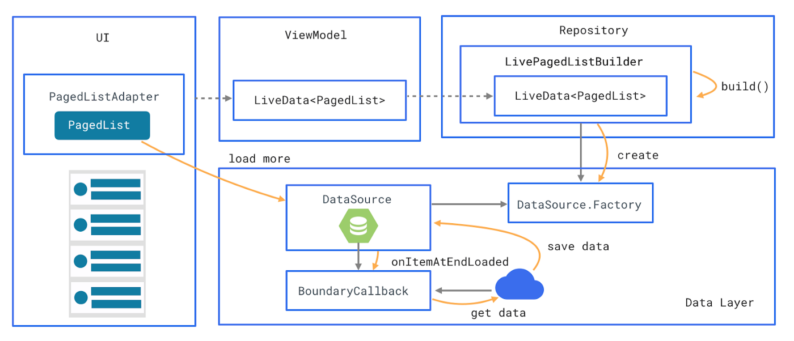

# KReddit

An Android Reddit client written in Kotlin with MVVM architecture.

## Developers

To set up the project, create a new Reddit app from your account and follow the below steps:
 * set the application redirect URI to: `kreddit://authenticate` (for login), you are free to change the redirect URI, but make sure to update the same in `AndroidManifest.xml` and `app/build.gradle` files with corresponding keys accordingly otherwise login will not work.
 * include your Reddit client id in the `gradle.properties` file

## Following features are supported:
 * MVVM architectural pattern
 * Login feature with automatic token refresh
 * Vote on feeds (like/dislike)
 * Offline support
 * Supports different screen sizes with master-detail flow
 * Unit test demonstration for business logic at network layer using JUnit & Mockito
 * Pull down to refresh the home feed

## Libraries used:

 * **Architecture components** : Navigation component, Room DB, LiveData & ViewModel, Paging library with boundary callback
 * **Coroutines** for offloading heavy tasks
 * **Dagger2** for dependency injection
 * **Retrofit2** & **OkHttp** for core networking
 * **Epoxy** for displaying an optimised list of feeds with smooth scroll. Currently Paging2 library is used as it is in a stable release, once Paging3 comes to release, it can be included.

 * **Groupie** for displaying comments section in feed details page
 * **MMKV** for having an efficient memory mapped preferences
 * **Glide** to display the images
